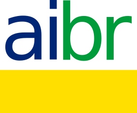

#  Aimeos Brasil - Open Source

# Escopo do Projeto

> **O que é escopo?** No gerenciamento de projetos, escopo são os recursos e funções definidos de um produto ou o escopo do trabalho necessário para concluir um projeto. O escopo envolve obter as informações necessárias para iniciar um projeto, incluindo os recursos que o produto precisa para atender aos requisitos das partes interessadas.

##### Sabendo que o significa escopo vamos seguir...

## Tópicos do Projeto

- [Objetivo](#)
- [Conceitos Gerais](#conceitos-gerais)
- [Tecnologia Disruptiva](#tecnologia-disruptiva)
- [Estratégia](#)
- [Aplicações Sugeridas](#marketplace)
- [Formas de Distribuição](#)
- [Formas de Suporte](#)
- [Tecnologias Utilizadas](#tecnologias-utilizadas)
- [Fontes de renda Extra](#)
- [Primeiros Passos](#seu-perfil--portfólio)

## Conceitos Gerais

#### Soluções simples de usar, escaláveis, adaptáveis, replicáveis, de baixo custo e lucrativas. 

#### Sobre o Desenvolvimento:

- [Manifesto para Desenvolvimento Ágil de Software](https://agilemanifesto.org/iso/ptbr/manifesto.html)

- [Princípios por trás do Manifesto Ágil](https://agilemanifesto.org/iso/ptbr/principles.html):
<ol>
	<li>Satisfação do cliente através de <strong>entrega contínua;</strong>
	<li>Mudanças são bem-vindas;
	<li>Entrega de <strong>Software funcional com frequência;</strong>
	<li>Executivos e desenvolvedores <strong>trabalham em conjunto;</strong>
	<li>Desenvolvimento de <strong>projetos em torno de pessoas motivadas;</strong>
	<li>O método mais e eficaz de transmitir informações para e entre uma equipe de desenvolvimento é por meio de <strong>conversa face a face;</strong>
	<li>Progresso medido através de <strong>Softwares funcionais;</strong>
	<li>Desenvolvimento <strong>constante e sustentável;<strong>
	<li>Excelência Técnica acima de tudo;
	<li>Simplicidade;
	<li>Times <strong>Autogerenciáveis;</strong>
	<li>Busca <strong>pela Efetividade.</strong>
</ol>

### Tecnologia disruptiva:

- Free and Open Source
	- Qual a diferença entre Software Livre (Free) e Código Aberto (Open Source)?
	> Embora os termos "software livre" e "open source" sejam frequentemente usados como sinônimos, eles não são exatamente a mesma coisa. Ambos se referem a softwares com código-fonte aberto, que permite que qualquer pessoa possa acessar e modificar o código-fonte do software, mas existem algumas diferenças sutis entre eles.

		🔸 SOFTWARE LIVRE (FREE)

	> O software livre é um movimento social que defende a liberdade dos usuários de software. O foco principal do movimento é garantir que os usuários tenham a liberdade de usar, estudar, modificar e distribuir o software, o que geralmente é acompanhado por uma licença que impõe algumas restrições para garantir que essas liberdades sejam mantidas. O software livre é frequentemente associado ao GNU Project e à Free Software Foundation (FSF), que criaram a GNU General Public License (GPL), uma das licenças de software livre mais usadas. 

		🔸 CÓDIGO ABERTO (OPEN SOURCE)
	> O open source, por outro lado, é um modelo de desenvolvimento de software que enfatiza a colaboração e o compartilhamento de código. O foco principal do movimento é incentivar o desenvolvimento colaborativo, garantindo que o código-fonte seja disponibilizado publicamente, permitindo que qualquer pessoa possa visualizá-lo, modificá-lo e redistribuí-lo, geralmente com menos restrições do que as licenças de software livre. O termo "open source" foi criado em 1998 por um grupo de indivíduos que desejava promover o desenvolvimento de software com código-fonte aberto, mas que acreditavam que o termo "software livre" tinha uma conotação política e ideológica.

		- Resumo
	> Em resumo, enquanto o software livre é mais um movimento social que promove as liberdades dos usuários de software, o código aberto é mais um modelo de desenvolvimento que enfatiza a colaboração e o compartilhamento de código. Ambos os termos se referem a softwares com código-fonte aberto, mas existem algumas diferenças sutis em relação a como os softwares são simultâneos e licenciados.

- Qual será o tipo de licença utilizado no projeto?	
	- MIT License
		- Quais são os termos da MIT License licença? 

		> A permissão é concedida gratuitamente a qualquer pessoa que obtenha uma cópia do software e arquivos de documentação associados para negociar o software sem restrições, incluindo sem limitação os direitos de usar, copiar, modificar, mesclar, publicar, distribuir, sublicenciar e/ou vender cópias do software e permitir que as pessoas a quem o Software é fornecido o façam, sujeito a as seguintes condições:   
		>O aviso de direitos autorais e este aviso de permissão devem ser incluídos em TODAS as cópias ou partes substanciais do Software.  
		>Em suma, o projeto será com base no Software livre e de Código aberto, licenciado de forma permissiva sob a MIT License, dando permissão para fazer cópias e total liberdade de como distribuir a aplicação, com código fechado ou aberto. Porém, sendo obrigado a fazer referência da origem, dando os créditos aos desenvolvedores do código original da aplicação, extensão, ou do aplicativo mobile e também não poderá alterar o tipo de licença em aplicações derivadas. 

### Marketplace
- O que é um Marketplace?
> Um marketplace é uma plataforma digital que conecta compradores e vendedores em um ambiente online, permitindo a realização de transações comerciais. Ele pode ser considerado um shopping virtual que reúne diversos fornecedores em um só lugar, permitindo que os consumidores encontrem uma ampla variedade de produtos e serviços em um único local.

> Geralmente, o marketplace é administrado por uma empresa protegida que atua como facilitadora das transações e cobra uma comissão sobre as vendas realizadas pelos vendedores.

- Quais os modelos de Marketplace?
	- Entre todos os modelos temos os principais:
		- B2B (Business-to-business)
		> No contexto de um marketplace, o modelo B2B (business-to-business) significa que a plataforma é usada para conectar empresas entre si, permitindo que elas comprem e vendam produtos e serviços umas das outras. Nesse modelo, as empresas são os clientes da plataforma e usam o marketplace para fazer negócios com outras empresas, seja na forma de compras em grandes aquisições, aquisição de matérias-primas ou fornecimento de serviços para outras empresas.

		> No modelo B2B, o marketplace é responsável por fornecer ferramentas e recursos para facilitar a negociação entre as empresas, como catálogos de produtos, negociação de preços, gestão de pedidos, gerenciamento de estoque, suporte ao cliente, entre outros. Além disso, a plataforma pode cobrar taxas sobre as transações realizadas pelas empresas em sua plataforma, como forma de monetização.
		- B2C (Business-to-consumer)
		> O modelo B2C (Business to Consumer) no marketplace é quando a plataforma é voltada para conectar empresas com consumidores finais. Nesse modelo, as empresas utilizam um canal de comercialização para plataformar seus produtos diretamente aos consumidores. Um exemplo de marketplace B2C é o Mercado Livre, onde empresas e vendedores independentes podem vender produtos para os consumidores finais que acessam a plataforma. A empresa responsável pela plataforma atua como protegida entre as partes, facilitando a transação comercial e recebendo uma comissão sobre as vendas realizadas. Esse modelo é comum em setores como varejo, moda, eletrônico, entre outros.
		- C2C (Consumer-to-consumer)
		> O modelo C2C (Consumer to Consumer) em um marketplace refere-se a transações comerciais realizadas diretamente entre consumidores finais, sem a participação de uma empresa estrangeira. Nesse modelo, os próprios usuários podem se cadastrar no marketplace e oferecer produtos ou serviços para venda, ou comprar de outros usuários do marketplace. O papel do marketplace é fornecer uma plataforma para essas transações acontecerem e, em alguns casos, pode oferecer ferramentas para facilitar a comunicação entre os usuários, como chat e sistema de estimativas. Exemplos de marketplaces com modelo C2C são o Mercado Livre e o eBay.

	##### Ufa, agora que sabemos os principais modelos de Marketplace, sabemos do que se trata e qual rumo o projeto irá tomar.

### Seu Perfil & Portfólio 

> Com todas essas informações agora vamos cuidar melhor do seu perfil.

- O que é GIT?

> Git é um sistema de controle de versão distribuída, que permite o gerenciamento de projetos de software e de outros arquivos de texto. Ele foi criado em 2005 por Linus Torvalds, o criador do sistema operacional Linux.

> O Git é uma ferramenta muito utilizada na programação, pois permite que várias pessoas trabalhem em um mesmo projeto, sem a necessidade de sobrescrever o trabalho dos outros. Ele mantém um registro de todas as alterações feitas no código-fonte e permite que os desenvolvedores compartilhem suas modificações e integrem-nas ao projeto principal de maneira organizada e eficiente. Isso ajuda a evitar conflitos de código, erros e perda de dados.

> O Git é uma ferramenta de linha de comando, mas também existem interfaces gráficas que facilitam sua utilização. Além disso, há muitos serviços de hospedagem de repositórios Git na nuvem, como o GitHub, o GitLab e o Bitbucket, que oferecem diversas funcionalidades adicionais, como integração com outros serviços e ferramentas de colaboração em equipe.

> Sabendo disso vamos para uma das ferramentas de GIT mais usadas, o GitHub.

- GitHub

> GitHub é uma plataforma de hospedagem e gerenciamento de projetos de software, baseada no controle de versão do Git. Ele permite que desenvolvedores e equipes colaborem em projetos, armazenando e gerenciando o código-fonte, documentos e outros recursos relacionados a um projeto de software. O GitHub oferece recursos como controle de versão, gerenciamento de problemas, wikis, integração contínua e outras ferramentas para facilitar a colaboração e o desenvolvimento de software.

- Tutorial de como usar GIT e GitHub:
	- https://www.youtube.com/watch?v=DqTITcMq68k
	- https://www.youtube.com/watch?v=UBAX-13g8OM

### Tecnologias Utilizadas:

#### Back-end:
- PHP

	> PHP é uma linguagem de programação interpretada de código aberto amplamente utilizada para desenvolvimento web. Ela foi criada por Rasmus Lerdorf em 1994, originalmente como uma coleção de scripts CGI escritos em linguagem de programação C. O nome "PHP" originalmente significava "Personal Home Page Tools", mas hoje é uma sigla recursiva para "PHP: Hypertext Preprocessor" .

	> PHP é uma linguagem de script do lado do servidor, o que significa que ela é executada no servidor web, em vez do navegador do usuário. Com PHP, é possível criar páginas dinâmicas, gerar conteúdo, criar formulários e interagir com bancos de dados. Ele pode ser combinado com HTML para criar páginas web, ou com outras linguagens de programação para criar aplicativos mais complexos.

	- Alguns dos principais recursos do PHP incluem:
		- Sintaxe simples e fácil de aprender;
		- Suporta vários bancos de dados, incluindo MySQL, Oracle, PostgreSQL e muitos outros;
		-  Suporta protocolos de rede como HTTP, SMTP, FTP e POP3;
		-  Compatibilidade com a maioria dos servidores web, incluindo Apache e Nginx;
		-  Grande comunidade de desenvolvedores que criaram uma grande quantidade de bibliotecas e frameworks para uso com PHP.

		> Em resumo, PHP é uma linguagem de programação amplamente utilizada para desenvolvimento web, que permite criar páginas dinâmicas e interagir com bancos de dados. Ele é fácil de aprender, amplamente suportado e tem uma grande comunidade de desenvolvedores que criam recursos e ferramentas adicionais para uso com a linguagem.

	- Afinal, o PHP está morrendo?

		> Não, o PHP não está morrendo. Embora tenha surgido há mais de 25 anos, o PHP continua sendo uma das linguagens de programação mais populares e amplamente usadas no desenvolvimento web. Ele é amplamente utilizado por grandes empresas, como Facebook, Wikipedia, Yahoo e Tumblr, bem como por pequenas e médias empresas e desenvolvedores independentes.

		> O PHP tem evoluído constantemente, com atualizações regulares e novas versões lançadas regularmente para melhorar o desempenho, a segurança e a usabilidade. Além disso, o PHP é uma das linguagens mais amigáveis para iniciantes e tem uma grande comunidade de desenvolvedores que oferecem suporte, recursos e exemplos de código.

		> Portanto, o PHP continua sendo uma linguagem de programação importante e relevante no desenvolvimento web, e provavelmente continuará a ser por muitos anos.

	- PHP e suas versões
		> O PHP é uma linguagem de programação popular, usada em uma ampla variedade de aplicações web. Ao longo dos anos, o PHP evoluiu bastante e muitos recursos foram adicionados em suas diferentes versões. A seguir, estão algumas das versões mais recentes do PHP e alguns de seus recursos.
		- **PHP 5.6**: suporta a sintaxe "use" para namespaces, permitindo que namespaces sejam facilmente importados sem a necessidade de aliases. Também foi apresentado o recurso de variáveis.
		- **PHP 7.0**: trouxe melhorias de desempenho em relação às versões anteriores do PHP, graças à implementação do novo mecanismo de gerenciamento de memória, chamado "Zend Engine 3.0". O PHP 7 também suporta a declaração "Scalar Type Hinting", permitindo especificar o tipo de dados esperados para argumentos de funções escalares.
		- **PHP 7.1**: adicionou a sintaxe "void" para funções, permitindo que as funções não retornem um valor. Também foi apresentado o recurso de captura dentro de expressões.
		- **PHP 7.2**: adicionou suporte para classes abstratas finais, que são classes abstratas que não podem ser puxadas. Também suporta o recurso de manipulação de exceção com retentores, que permite retomar o fluxo de execução de um código após o tratamento de exceção.
		- **PHP 7.3**: apresentou o recurso de "heredoc" sem identificação, permitindo que blocos de texto grandes sejam facilmente inseridos no código. Também interpretou a sintaxe "??=", permitindo que se atribua um valor padrão a uma variável.
		- **PHP 7.4**: adicionou o operador "arrow", que permite acessar propriedades de objetos aninhados em uma única linha de código. Também suporta a função "str_contains()", que verifica se uma string contém outra.
		- **PHP 8.0**: trouxe melhorias de desempenho em relação às versões anteriores do PHP, além de adicionar novos recursos, como "Named Arguments", "Union Types", "Constructor Property Promotion" e "Match Expression".
		> Em resumo, cada versão do PHP traz melhorias e novos recursos para a linguagem, tornando-a cada vez mais poderosa e útil para o desenvolvimento de aplicações web.]
	
#### Front-end: 

- JavaScript:

	- O que é? 

		- O JavaScript é uma linguagem de programação de alto nível voltada para o desenvolvimento web, criada originalmente para funcionar do lado do usuário, ou seja, nos navegadores. Junto do HTML e do CSS, é uma das principais tecnologias da web, permitindo a criação de páginas interativas com elementos dinâmicos e boa performance. Foi criada em 1995 por Brendan Eich enquanto trabalhava na Netscape Communications Corporation, é baseada em ECMAScript padronizada pela Ecma international nas especificações ECMA-262 e ISO/IEC 16262. Além disso, ela é utilizada principalmente para Front-End (o que o usuário enxerga), mas também é possível utilizá-la para Back-End com auxílio do Node.js.

	- Qual sua função? 

		- Ela é responsável pelo dinamismo do site e abre o leque de possibilidades na hora de criar uma página web. É estruturada a partir de funções e scripts que funcionam em conjunto com uma página feita em HTML. Roda direto no navegador do usuário, sendo um ponto positivo para tornar seu entendimento mais ágil pelo computador. Recebe dados do servidor de maneira síncrona e assíncrona, dependendo da funcionalidade explicitada no código, validando os dados e exibindo as informações em tempo real. 

	- Algumas das principais vantagens do JavaScript:

		- Leve e rápida;
		- Sintaxe acessível e de fácil compreensão;
		- Compatível com uma grande variedade de navegadores;
		- Versatilidade da linguagem (front-end e back-end);
		- Comunidade numerosa e colaborativa em todo o mundo;

	- Algumas das principais desvantagens do JavaScript:	
		
		- É vulnerável brechas de segurança nos sistemas, navegadores e páginas envolvidas;
		- Pode ser usada para executar programas maliciosos sem que o usuário saiba
		- O JavaScript, normalmente, é interpretado de forma única por cada navegador, o que complica a escrita de códigos diferentes para vários navegadores;

	- Principais frameworks:

		- React;
		- Vue.js;
		- Node.js;
		- JQquery;
		- Cordova;
		- Electron;
	  
	>Em suma, o JavaScript é uma linguagem de programação de alto nível e é baseada em ECMAScript padronizada pela Ecma international, ela é uma das principais utilizadas em aplicações web, isso porque se destaca por deixar as páginas Web dinâmicas, que é sua principal função. Ademais, o JavaScript é considerada uma linguagem leve, versátil, de fácil compreensão e com uma grande base de comunidade colaborativa.

	- Recomendações de vídeos e artigos explicando um pouco mais sobre a linguagem:
		
	- [Vídeo: O que é JavaScript?](https://www.youtube.com/watch?v=NaVSbnnV75Q)
		- [Artigo: O tutorial do JavaScript Moderno](https://javascript.info/)
		- [Artigo: O que é JavaScript?](https://www.weblink.com.br/blog/programacao/o-que-e-javascript/)
		- [Guia do JavaScript:](https://www.alura.com.br/artigos/javascript)

### Frameworks:

- O que são frameworks?

> Um framework é uma estrutura que serve de base para a construção de aplicações web de finalidade específica cujo desenvolvimento pode ser muito custoso e/ou problemático. Com um framework é possível construir sites, aplicativos e softwares a partir de um esqueleto pré-definido, alterando apenas demais particularidades.

#### Flutter:

- Partindo para Flutter, o que seria esse framework?

> Flutter é um framework de desenvolvimento de aplicativos móveis lançado pela Google em 2017. Ele permite desenvolver aplicativos nativos para iOS e Android usando uma única base de código, escrita em Dart, uma linguagem de programação criada pela Google.

> O Flutter se destaca por sua facilidade de uso, rapidez de desenvolvimento e pela facilidade de personalização de interfaces gráficas de usuário (GUIs), que podem ser altamente customizadas para atender às necessidades específicas de cada aplicativo. Ele também oferece recursos como hot-reload, que permite que os desenvolvedores vejam as mudanças em tempo real enquanto trabalham no código, o que acelera o processo de desenvolvimento.

> Além disso, o Flutter conta com uma ampla gama de bibliotecas e plugins para adicionar recursos adicionais aos aplicativos, como integração com câmera, mapas, notificações push, autenticação, entre outros.

 > Em resumo, o Flutter é uma ferramenta poderosa para o desenvolvimento de aplicativos móveis de alta qualidade, permitindo que os desenvolvedores criem aplicativos em menos tempo e com menos esforço do que seria necessário com outras ferramentas.

- Vídeo mais específico a respeito do Flutter:
- [Link video Flutter](https://www.youtube.com/watch?v=YejIetyu5fU)

#### React Native:

- O que é? 

	- O React Native nasceu em 2013 em um hackathon entre desenvolvedores do Facebook e foi Lançado ao público em 2015 sobre a licença MIT. O React Native é um <strong>Framework</strong> para desenvolvimento de aplicativos móveis multiplataforma, ou seja, um framework híbrido. Ele é Baseado no React, (um framework JS para desenvolvimento web), com o React Native ele possibilita a criação de aplicações móvel multiplataforma (Android e iOS) utilizando apenas Javascript. Porém, diferente de outros frameworks com esta mesma finalidade (Cordova, por exemplo), todo o código desenvolvido com o React Native é convertido para linguagem nativa do sistema operacional, o que torna o app muito mais fluido.

- Qual a sua principal função? 

	- O framework aumenta a produtividade e praticidade no desenvolvimento de aplicações mobile híbridas através de funcionalidades muito interessantes e que se diferem de outras opções para desenvolvimento mobile, tais como:

			- Geração de código nativo;
			- Desenvolvimento utilizando componentes;
			- Live reload / Hot reloading; 

		Além disso, ele tem como objetivo melhorar a experiência do usuário.

- Algumas das principais vantagens do React Native:

	- Facilidade em trabalhar;
	- Desenvolvimento multiplataforma;
	- Maior alcance de usuários;
	- Componentes pré-desenvolvidos/nativos;
	- Custo de manutenção menor;
	- Ambiente de trabalho;

- Algumas das principais desvantagens do React Native:	
		
	- Desempenho menor que o React.js
	- Dependência no Facebook;
	- Sem módulos personalizados;
	- Problemas de compatibilidade;
	  

	> Em resumo, o React Native é um framework JavaScript que permite o desenvolvimento de aplicativos móveis nativos para Android e iOS utilizando a mesma base de código. Ele foi criado pelo Facebook em 2015 e é baseado no React, um framework utilizado para construir aplicações web. Com o React Native, os desenvolvedores podem escrever código em JavaScript e utilizar componentes pré-construídos para criar interfaces de usuário para seus aplicativos móveis. O React Native permite que os aplicativos sejam desenvolvidos de maneira rápida e eficiente e com um menor custo de manutenção. 

- Recomendações de vídeos e artigos explicando um pouco mais sobre o React Native:
		
	- [Artigo: React Native: o que é e tudo sobre o Framework](https://www.alura.com.br/artigos/react-native)
	- [Artigo: O que é React Native?](https://www.treinaweb.com.br/blog/o-que-e-o-react-native)
	- [Artigo: Vale a pena utilizar React Native?](https://programadoresdepre.com.br/o-que-e-react-native-e-vale-a-pena-usar/)
	- [Como começar no React Native em 2023](https://www.youtube.com/watch?v=CO4C9UVaFKk)
	- [React Native vs Flutter!](https://www.youtube.com/watch?v=MbftjVCb3j8)

- Diferenças entre React e React Native:

	- O React.js é conhecido como React ou o ReactJS, ele é uma biblioteca do JavaScript utilizado para desenvolvimento de aplicações web, enquanto o React Native é um framework utilizado para desenvolvimento de aplicativos móveis nativos para Android e iOS.  
	
		> Enquanto o React é voltado para o desenvolvimento de aplicações web que são executadas no navegador, o React Native é voltado para o desenvolvimento de aplicativos móveis nativos que são executados diretamente no sistema operacional do dispositivo móvel.   
		> Além disso, o React Native utiliza componentes específicos par dispositivos móveis, que são diferentes dos componentes utilizados no React para aplicações web. Isso ocorre porque as interfaces de usuário de aplicativos móveis e web têm diferenças significativas, como tamanho de tela e interação do usuário. Apesar dessas diferenças, a sintaxe e a estrutura dos componentes em ambos os frameworks são semelhantes, o que permite que os desenvolvedores que já conhecem o React possam aprender o React Native com facilidade.
		
## A metodologia dos 9 pilares do e-commerce
		 
### A metodologia dos Nove Pilares dá base a todo o trabalho de E-commerce.

Esta metodologia ficou conhecida pelo "Guia de E-commerce" desenvolvido pelo SEBRAE, projeto liderado por Thiago Sarraf e embasado por anos de experiência no mercado. São os pilares:

[x] Planejamento 
[x] Sistemas e Integração 
[x] Equipe 
[x] Comunicação Visual 
[x] Conteúdo 
[x] Logística 
[x] Pagamento 
[x] Selos e Segurança 
[x] Marketing

## 💪 Contribuidores da Comunidade

##### Um mundo livre e aberto depende de sistemas, de aplicativos e da web livres e abertos.

##### Nossa missão é contribuir para o mundo tecnologicamente Open Source.

#### Continuem arrasando!!! 🥂
		 
